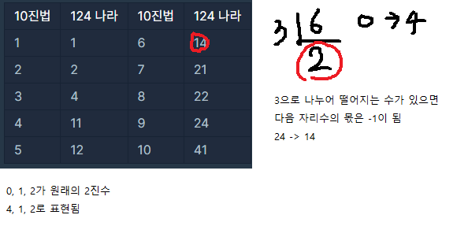


> **[124 나라의 숫자](https://programmers.co.kr/learn/courses/30/lessons/12899#)**


```java
import java.util.Stack;

class Solution {
    public String solution(int n) {
        String answer = "";
        Stack<Integer> stack = new Stack<>();

        while(n>0){
            int sub = n%3;
            n=(n-1)/3;
            if(sub==0) 
                sub=4;
            stack.push(sub);
        }

        while(!stack.isEmpty())
            answer+=Integer.toString(stack.pop());
        
        return answer;
    }
}
```
```java
import java.util.Stack;

class Solution {
    public String solution(int n) {
        String answer = "";
        Stack<Integer> stack = new Stack<>();

        while(n>0){
            int sub = n%3;
            n /= 3;
            
            if(sub==0){
                stack.push(4);
                n--;
            }else
                stack.push(sub);
        }

        while(!stack.isEmpty())
            answer+=Integer.toString(stack.pop());
        
        return answer;
    }
}
```
* * *
실패코드

	* String을 더하면 시간초과 문제 발생

```java
import java.util.Stack;

class Solution {
    public String solution(int n) {
        String answer = "";

        if(n==3)
            return "4";
        
        while(n>0){
            int sub = n%3;
            n /= 3;
            
            if(sub==0){
                answer+=4;
                n--;
            }else{
                answer+=sub;
            }
        }
        
        StringBuffer sb = new StringBuffer(answer);
;
        return sb.reverse().toString();
    }
}
```
```java
import java.util.Stack;

class Solution {
    public String solution(int n) {
        String answer = "";
        Stack<Integer> stack = new Stack<>();
        if(n==3)
            return "4";
        
        while(n>0){
            int sub = n%3;
            n /= 3;
            
            if(sub==0){
                answer=4+answer;
                n--;
            }else{
                answer=sub+answer;
            }
        }
        
        return answer;
    }
}
```


