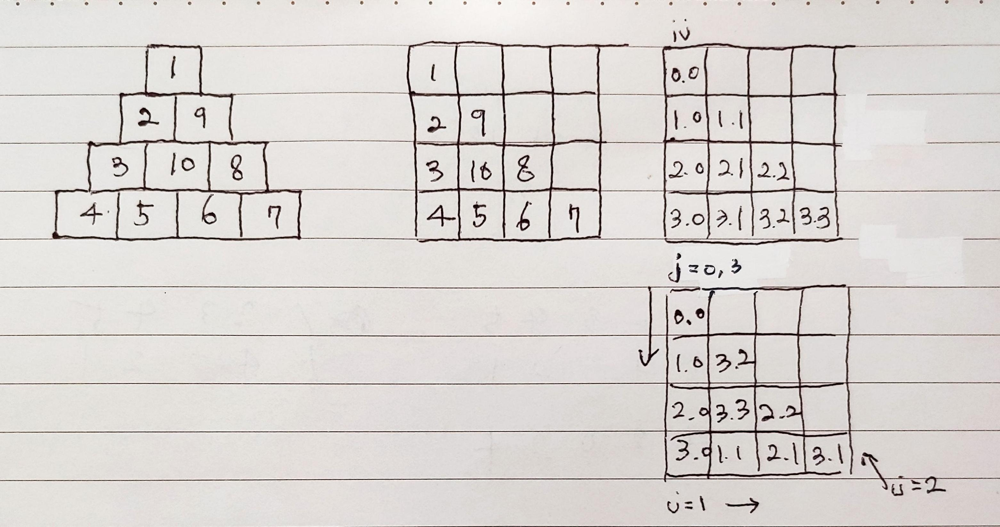

> **[삼각 달팽이](https://programmers.co.kr/learn/courses/30/lessons/68645)**



	* 수열로 하아안참 생각하다 그냥 시뮬레이션으로 풀었다.

```java
class Solution {
    public int[] solution(int n) {
        int[] answer = new int[n*(n+1)/2];
        int[][] pyramid = new int[n][n]; //입력될 2차원 배열
        int y = -1, x=0; //입력할 좌표
        int cnt = 1; //입력될 수
        int index=0;
        for(int i = 0; i<n; i++){
            for(int j = i; j<n; j++){ //꺽일때마다 입력할 수가 한개씩 줄어듦
                if(i%3==0){ //아래
                    y++; 
                }else if(i%3==1){ //오른쪽
                    x++; 
                }else{ //대각성
                    x--;
                    y--;
                }
                pyramid[y][x] = cnt++;
            }
        }
        
        
        for(int[] p:pyramid){
            for(int el:p){
                if(el==0)
                    break;
                answer[index++] = el;
            }
        }
        return answer;
    }
}
```
